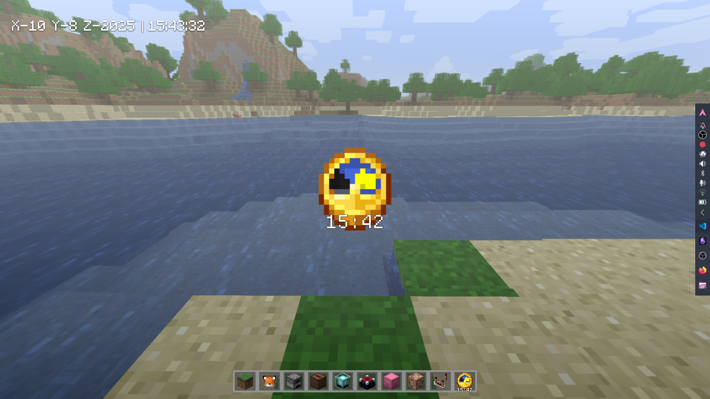

# 🕰️ MC Clock — Minecraft-style Clock Plasmoid (Plasma 6)

Package ID: `mc_clock`

Small, lightweight widget showing a Minecraft-like day/night clock using a 64-frame PNG strip (or 64 separate frames). Optional digital time overlay and a couple of simple settings — perfect for Plasma 6 (X-Plasma-API >= 6.0).



---

## 🧩 What it does

- 64-frame animation mimicking Minecraft's clock/compass cycle
- Optional digital time overlay (toggle in settings)
- Small, QML + JS implementation; minimal dependencies

---

## 📂 Layout (what you should have)

```
mc_clock/
├── contents
│   ├── config
│   │   └── config.qml
│   │   └── main.xml        (defaults: showTime, imagePadding)
│   └── ui
│       ├── main.qml        (UI + frame selection logic)
│       ├── configGeneral.qml
│       └── clock/
│           ├── pixil-frame-0.png
│           ├── ...
│           └── pixil-frame-63.png
├── metadata.json
├── preview.png
└── README.md
```

If you store frames as a single strip, `main.qml` will still pick frames if the code references the correct source. If frames are missing, the widget will log frame indices to the QML console.

---

## ⚙️ Quick install (user-local)

Recommended for testing:

```bash
mkdir -p ~/.local/share/plasma/plasmoids/
cp -r mc_clock ~/.local/share/plasma/plasmoids/
```

Then restart Plasma or run:

```bash
plasmoidviewer ~/.local/share/plasma/plasmoids/mc_clock/contents/ui/main.qml
```

System-wide (requires root):

```bash
sudo cp -r mc_clock /usr/share/plasma/plasmoids/
```

---

## 🎮 Usage

- Add via **Desktop → Add Widgets → MC Clock**
- The QML reads system time (JS `Date`) and maps 24 hours to 64 frames (frame 0 is noon)
- Enable the digital overlay in **Configure → MC Clock** if desired

**Time → frame mapping:** 24 hours → 64 frames, continuous progression for smooth updates.

---

## ⚙️ Settings

Right-click → **Configure MC Clock...**

Key options (defined in `contents/config/main.xml`):

- `showTime` (boolean) — show/hide digital overlay
- `imagePadding` (0–50) — padding around the clock image

Defaults are in `contents/config/main.xml`. Adjust values there to change defaults.

---

## 🧪 Development notes

- Frames are named `pixil-frame-0.png` … `pixil-frame-63.png` in `contents/ui/clock/`
- `main.qml` uses `Date()` to compute minutes-since-midnight → frame index
- Test with **plasmoidviewer** for instant reload and console diagnostics

---

## ⚠️ Troubleshooting

- "Cannot load image" → ensure `contents/ui/clock/` contains all frame files and filenames match
- Logs: `journalctl --user -f | grep plasmashell`
- If you changed paths, ensure `main.qml` points to the right image directory

---

## 📜 License
**GNU General Public License v3.0 or later**

```
Copyright (C) 2025 CAL (calamytryx)

This program is free software: you can redistribute it and/or modify
it under the terms of the GNU General Public License as published by
the Free Software Foundation, either version 3 of the License, or
(at your option) any later version.
```

See [LICENSE](LICENSE) for full text.

---

## 🙏 Credits

Built for **KDE Plasma 6**. Inspired by the Minecraft clock/compass. Author: **CAL** (see `metadata.json`).

---

## 💬 Fun Fact

> MC Clock uses 64 tiny frames to simulate a Minecraft day/night cycle — just like in-game, but on your desktop! 😆
